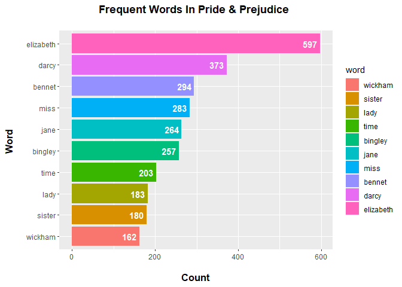

<u>Assignment B-4</u>
================

## Option A - Strings and functional programming in R

#### <u>Exercise 1</u> : Make a plot of the most common words from a book, removing “stop words”.

Installing the required packages.

``` r
#Uncomment the following code chunck to install the required packages.
#install.packages("janeaustenr")
#install.packages("tidytext")
```

Loading the required packages.

``` r
library(janeaustenr)
```

    ## Warning: package 'janeaustenr' was built under R version 4.3.2

``` r
library(tidytext)
```

    ## Warning: package 'tidytext' was built under R version 4.3.2

``` r
library(tidyverse)
```

    ## ── Attaching core tidyverse packages ──────────────────────── tidyverse 2.0.0 ──
    ## ✔ dplyr     1.1.3     ✔ readr     2.1.4
    ## ✔ forcats   1.0.0     ✔ stringr   1.5.0
    ## ✔ ggplot2   3.4.3     ✔ tibble    3.2.1
    ## ✔ lubridate 1.9.2     ✔ tidyr     1.3.0
    ## ✔ purrr     1.0.2     
    ## ── Conflicts ────────────────────────────────────────── tidyverse_conflicts() ──
    ## ✖ dplyr::filter() masks stats::filter()
    ## ✖ dplyr::lag()    masks stats::lag()
    ## ℹ Use the conflicted package (<http://conflicted.r-lib.org/>) to force all conflicts to become errors

``` r
library(ggplot2)
```

Filtering the Pride & Prejudice book from the collection of books from
the janeaustenr package.

``` r
pride_and_prejudice <- austen_books() %>%
  filter(book == "Pride & Prejudice")

# Selecting the text of the book
book_text <- pride_and_prejudice["text"]
```

Analyzing the content of the text to check if it’s format is as
required.

``` r
head(book_text, n = 20)
```

    ## # A tibble: 20 × 1
    ##    text                                                                         
    ##    <chr>                                                                        
    ##  1 "PRIDE AND PREJUDICE"                                                        
    ##  2 ""                                                                           
    ##  3 "By Jane Austen"                                                             
    ##  4 ""                                                                           
    ##  5 ""                                                                           
    ##  6 ""                                                                           
    ##  7 "Chapter 1"                                                                  
    ##  8 ""                                                                           
    ##  9 ""                                                                           
    ## 10 "It is a truth universally acknowledged, that a single man in possession"    
    ## 11 "of a good fortune, must be in want of a wife."                              
    ## 12 ""                                                                           
    ## 13 "However little known the feelings or views of such a man may be on his"     
    ## 14 "first entering a neighbourhood, this truth is so well fixed in the minds"   
    ## 15 "of the surrounding families, that he is considered the rightful property"   
    ## 16 "of some one or other of their daughters."                                   
    ## 17 ""                                                                           
    ## 18 "\"My dear Mr. Bennet,\" said his lady to him one day, \"have you heard that"
    ## 19 "Netherfield Park is let at last?\""                                         
    ## 20 ""

Splitting the contents of the text into words using the *unnest_tokens*
function.

``` r
book_words <- book_text %>% 
                  unnest_tokens(output = word, input = text) 
head(book_words)
```

    ## # A tibble: 6 × 1
    ##   word     
    ##   <chr>    
    ## 1 pride    
    ## 2 and      
    ## 3 prejudice
    ## 4 by       
    ## 5 jane     
    ## 6 austen

Removing stop word from the contents of the book. The stop words are
from the *tidytext* package.

``` r
book_words <- book_words %>%
                   anti_join(stop_words) 
```

    ## Joining with `by = join_by(word)`

Counting the number of times each word is repeated in the book.

``` r
book_wordcounts <- book_words %>% count(word, sort = TRUE)

head(book_wordcounts)
```

    ## # A tibble: 6 × 2
    ##   word          n
    ##   <chr>     <int>
    ## 1 elizabeth   597
    ## 2 darcy       373
    ## 3 bennet      294
    ## 4 miss        283
    ## 5 jane        264
    ## 6 bingley     257

Plotting the top 10 most repeated words in the book.

``` r
book_wordcounts %>% 
  slice_max(n, n=10) %>% #Get the top 10 most frequent words
  mutate(word = reorder(word, n)) %>% # Mutate and reorder the words based on frequency 
    ggplot(aes(word, n, fill = word)) + 
    geom_col() +
    coord_flip() +
    labs(x = "Word \n", y = "\n Count ", title = "Frequent Words In Pride & Prejudice \n") +
    geom_text(aes(label = n), hjust = 1.2, colour = "white", fontface = "bold") +
    theme(plot.title = element_text(face="bold", hjust = 0.5), 
        axis.title.x = element_text(face="bold", size = 12),
        axis.title.y = element_text(face="bold", size = 12))
```

<!-- -->

#### <u>Exercise 2</u> : Make a function that converts words to your own version of Pig Latin

Loading the required packages.

``` r
library(stringr)
library(testthat)
```

    ## Warning: package 'testthat' was built under R version 4.3.2

    ## 
    ## Attaching package: 'testthat'

    ## The following object is masked from 'package:dplyr':
    ## 
    ##     matches

    ## The following object is masked from 'package:purrr':
    ## 
    ##     is_null

    ## The following objects are masked from 'package:readr':
    ## 
    ##     edition_get, local_edition

    ## The following object is masked from 'package:tidyr':
    ## 
    ##     matches

``` r
#' Dog Latin Transformation
#'
#' @description Transforms a given word into Dog Latin.
#' 
#' @details 
#' This function takes a word as input and transforms it into Dog Latin.
#' 
#' Dog latin is a modified version of Pig latin. 
#' In Dog latin if a word starts with a vowel, it's doggified version is obtained
#' by adding "ruff" to the beginning of the word. 
#' If a word starts with consonant or consonant cluster, all letters after the first vowel 
#' are moved to beginning of the word and "woff" is added at the start of the rearranged 
#' combination.
#' 
#' If the input is not a valid word (e.g., not a character or contains non-alphabetic characters), an error is thrown.
#' is_vowel function has been defined inside the dog_latin function. This checks if a given letter is a vowel.
#'  
#' @param word A character string representing the word to be transformed.
#'
#' @return A character string representing the Dog Latin version of the input word. 
#'
#' @examples
#' dog_latin("apple")  # Returns "ruffapple"
#' dog_latin("banana") # Returns "anabawoff"
dog_latin <- function(word){
  if(!is.character(word)){ 
    if(is.na(word)){
      stop("Input is missing. Give the function a word to get the dogified version of it.")
    }
    else{
      stop("Input should be a string. You inputted an object of class ", class(word), ".")
    }
  }
  else{
    if(length(word) > 1){
      stop("Input should be a single word. Your input is of the length ", length(word), ".")
    }
    if(! grepl('^[A-Za-z]+$', word)){
      stop("The word should only consist of letters from english alphabets.")
    }
  }
  
  vowels <- c ("a", "e", "i", "o", "u") #defining the vowel list
  first_letter <- str_sub(word, start = 1, end = 1) #getting the first vowel
  is_vowel <- function(l) l %in% c(vowels, toupper(vowels))
  
  if (is_vowel(first_letter)) {
    answer <- str_c("ruff", word)
  }
  else{
    letters <- str_split(word, "")[[1]]
    first_vowel_index <- detect_index(letters, is_vowel)
    after_vowel <- str_sub(word, start = first_vowel_index + 1, end = -1)
    remaining_word <- str_sub(word, start = 1, end = first_vowel_index)
    answer <- str_c("woff",after_vowel, remaining_word)
  }
  return (answer)
}
```

Four different test_that functions have been written in order to test
the working of the function.

``` r
test_that("Output word formats match to dog latin rules" , {
  expect_equal(dog_latin("time"), "woffmeti")
  expect_equal(dog_latin("apple"), "ruffapple")
})
```

    ## Test passed 🥇

``` r
test_that("Incorrect input formats generate errors", {
  expect_error(dog_latin(TRUE))
  expect_error(dog_latin(1))
  expect_error(dog_latin(list("a", "b", "c")))
})
```

    ## Test passed 🥇

``` r
test_that("Input letters that are not part of English alphabets are rejected" , {
  expect_error(dog_latin("!abc"))
})
```

    ## Test passed 🌈

``` r
test_that("NA values are not accepted as input", {
  expect_error(dog_latin(NA))
  })
```

    ## Test passed 🥇
